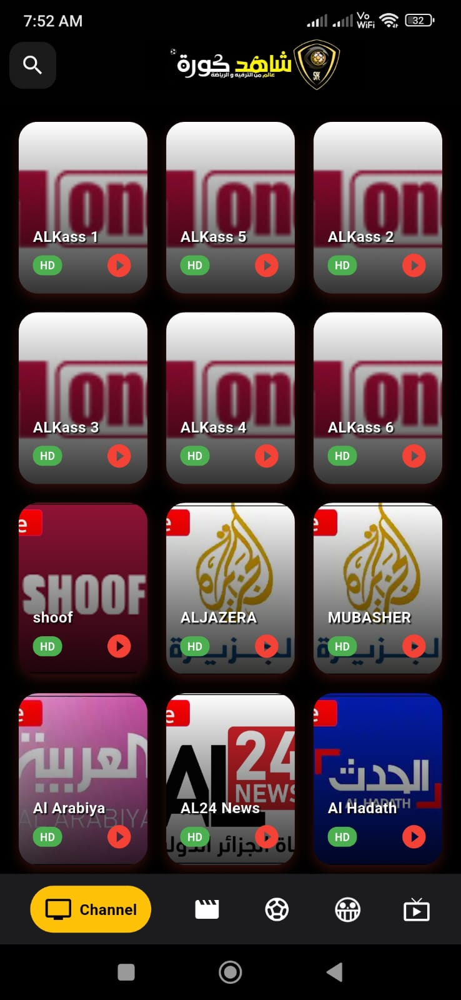
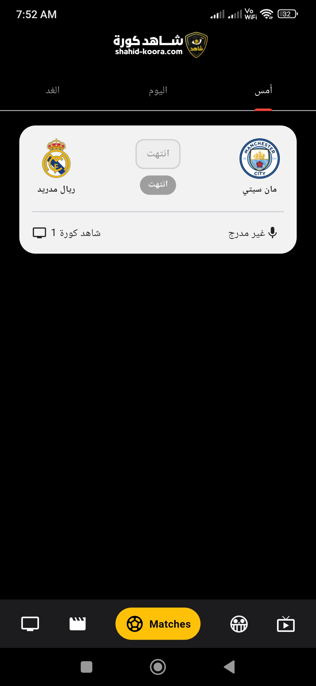
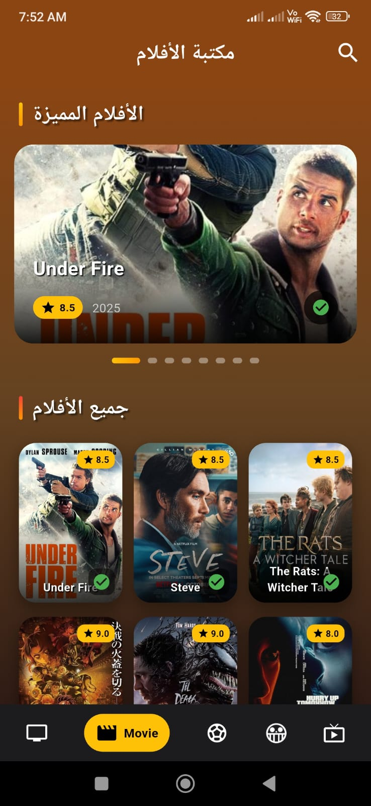
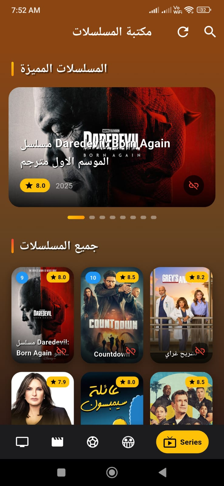
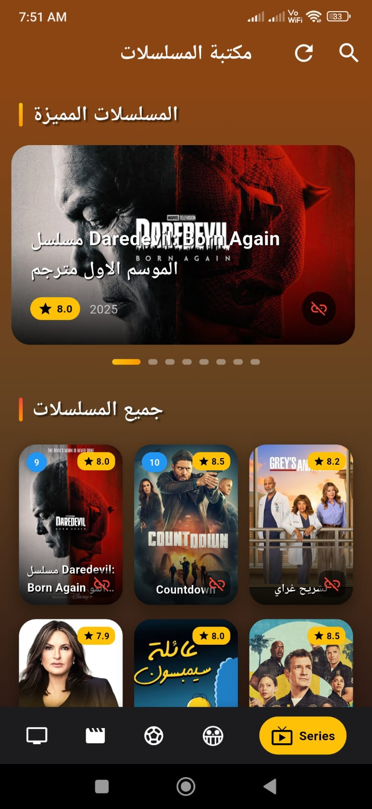

# 🎬 Shahid Kora - شاهد كورة

<p align="center">
  
</p>

<p align="center">
  <b>منصة متكاملة للبث المباشر - مباريات، أفلام، مسلسلات، وأنمي</b>
  <br>
  Complete Streaming Platform - Live Sports, Movies, Series & Anime
</p>

<p align="center">
  
  
  
  
  
</p>

---

## 📱 عن التطبيق

**Shahid Kora** هو تطبيق بث مباشر شامل يقدم محتوى متنوع:

- ⚽ **قنوات رياضية** - بث مباشر لمباريات كرة القدم (Alkass, SHOOF, Al Jazeera)
- 🎬 **أفلام** - مكتبة ضخمة من الأفلام العربية والعالمية
- 📺 **مسلسلات** - أحدث المسلسلات المترجمة والمدبلجة
- 🏀 **رياضات متنوعة** - كرة سلة، تنس، رياضات أخرى
- 🎞️ **أنمي** - حلقات أنمي محدثة باستمرار

---

## ✨ الميزات الرئيسية

### 📺 **البث المباشر**
- ✅ **قنوات رياضية متعددة**: Alkass 1-6, SHOOF, Al Jazeera, MUBASHER
- ✅ **قنوات إخبارية**: Al Arabiya, AL24 News, Al Hadath
- ✅ **جودة HD** - بث عالي الدقة
- ✅ **مشغل فيديو مخصص (SKO Player)** - تحكم كامل في التشغيل

### 🎬 **المكتبات**
- ✅ **مكتبة الأفلام** - أحدث الأفلام المميزة مع تقييمات
- ✅ **مكتبة المسلسلات** - مسلسلات مترجمة ومدبلجة
- ✅ **مكتبة الأنمي** - حلقات أنمي محدثة
- ✅ **بحث وتصفية** - ابحث بسهولة عن المحتوى المفضل

### 💻 **لوحة تحكم سطح المكتب**
- ✅ **إدارة المحتوى** - رفع أفلام، مسلسلات، قنوات جديدة
- ✅ **إحصائيات** - عدد المشاهدات، تقييمات المستخدمين
- ✅ **إدارة الإعلانات** - التحكم في إعدادات AdMob

### 🎯 **ميزات إضافية**
-
- ✅ **تقييم المحتوى** - تقييمات ومراجعات المستخدمين
- ✅ **المشاهدة لاحقاً** - حفظ المحتوى للمشاهدة لاحقاً
- ✅ **المفضلة** - إضافة قنوات وأفلام للمفضلة

---

## 📸 لقطات الشاشة

### الشاشة الرئيسية وقنوات البث
<p align="center">
  
</p>

## 📸 لقطات الشاشة

### قنوات البث المباشر
<div align="center">
  
  
</div>

### مكتبة الأفلام
<div align="center">
  
</div>

### مكتبة المسلسلات
<div align="center">
  
  
  
</div>

## 🎯 وصف اللقطات

| الصورة | الوصف |
|--------|-------|
| `1.jpeg` | قنوات البث المباشر - Alkass, SHOOF, Al Jazeera, قنوات إخبارية |
| `2.jpeg` | مكتبة الأفلام - أحدث الأفلام مع التقييمات (Under Fire, Steve) |
| `3.jpeg` | المباريات - جدول المباريات اليوم والأمس |
| `4.jpeg` | مكتبة المسلسلات - Daredevil: Born Again, مسلسلات مترجمة |
| `6.jpeg` | تفاصيل المسلسل - معلومات الحلقات والتقييم |
| `7.jpeg` | قائمة المسلسلات - جميع المسلسلات المتاحة |

---

## 🛠️ التقنيات المستخدمة

| التقنية | الغرض |
|---------|-------|
| **Flutter** | إطار العمل الرئيسي |
| **SKO Player** | مشغل فيديو مخصص (Custom Video Player) |
| **AdMob** | إعلانات (Banner, Interstitial, Rewarded) |
| **Firebase** | مصادقة، إشعارات، قاعدة بيانات |
| **Hive** | تخزين محلي (المفضلة، المشاهدة لاحقاً) |
| **BLoC** | إدارة الحالة |
| **Dio** | استدعاءات API |
| **Desktop Embedding** | دعم سطح المكتب (Windows, macOS, Linux) |

---

## 🚀 كيفية التشغيل

### المتطلبات الأساسية
```bash
Flutter SDK: 3.16.0+
Dart SDK: 3.2.0+
Android Studio / VS Code
